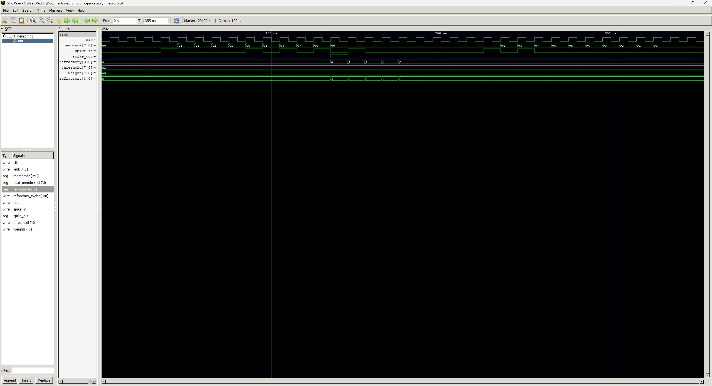

# Digital LIF Neuron — Neuromorphic RTL Design on Sky130

> A biologically inspired leaky integrate-and-fire neuron, implemented in Verilog, verified with a full testbench, and synthesized to silicon using the open-source Sky130 PDK via OpenLane.

---

## Why I built this

In my Electronic Circuits and Network Analysis course, I was studying how neurons in the brain actually fire — how charge accumulates, leaks, and eventually crosses a threshold to generate a spike. I got curious about whether the same dynamics could be captured in silicon.

That curiosity turned into two parallel projects:

- A **nanopower analog LIF circuit** built with discrete transistors and diodes, validated with Monte Carlo simulations, and documented in a research paper
- This **digital RTL implementation** — built to learn Verilog properly by designing something real, not a tutorial exercise

The goal was simple: understand every layer of a neuromorphic system, from biology to circuit to chip.

---

## What this project does

This repo implements a discrete-time LIF neuron in Verilog with configurable biological parameters, verified against a full testbench, and synthesized to a GDS layout using OpenLane + Sky130.

### Neuron behaviour

A LIF neuron works like a leaky capacitor:
- **Input spikes** charge the membrane potential
- **Leak** continuously drains it
- When potential crosses the **threshold**, the neuron fires a 1-cycle spike and enters a **refractory period** during which it cannot fire again
- After the refractory period, the cycle repeats

---

## Features

| Feature | Description |
|---|---|
| Signed membrane integration | Handles weighted input and continuous leak |
| Threshold-based spiking | 1-cycle output pulse on threshold crossing |
| Refractory period control | Biologically accurate post-spike blocking |
| Runtime-configurable parameters | Weight, threshold, leak rate, refractory duration all adjustable without recompilation |
| Membrane clamping | Prevents negative potential — a key edge case in discrete-time models |
| Clean RTL structure | Combinational and sequential logic separated for synthesis readiness |

---

## Repository structure

```
neuromorphic-processor/
├── design/          # RTL source (lif_neuron.v)
├── testbench/       # Verification (lif_neuron_tb.v)
├── gds/             # OpenLane synthesis output (Sky130 layout)
├── lif_neuron.vcd   # Simulation waveform output
└── README.md
```

---

## Simulation

The testbench verifies all critical neuron behaviours:

- Membrane accumulation under sustained input
- Leak decay between inputs
- Threshold crossing and spike generation
- Refractory period — spikes blocked even under input
- Edge case: membrane clamping at zero

**To simulate with iverilog:**

```bash
iverilog -o lif_tb design/lif_neuron.v testbench/lif_neuron_tb.v
vvp lif_tb
gtkwave lif_neuron.vcd
```



---

## ASIC synthesis

The design was synthesized using **OpenLane** with the **SkyWater Sky130 open-source PDK** — the same process node used by Google's open shuttle program.

The GDS layout files are in `/gds`.

---

## What I learned

**The refractory period edge case** was the most interesting problem. In continuous-time models, the neuron simply stops responding after a spike. In a synchronous digital design, you have to explicitly track refractory cycles and gate the membrane update — otherwise the neuron double-fires on the cycle it resets. Getting this right required careful separation of next-state logic from registered output.

**Membrane clamping** was a second non-obvious edge case. Without it, signed subtraction during heavy leak can wrap the membrane to a large positive value — causing spurious spikes. Clamping to zero on underflow is biologically correct and numerically necessary.

**Discrete-time approximation** introduces timing error relative to a continuous LIF model. The spike timing depends on your clock frequency and leak coefficient — worth understanding if you're using this for SNN inference.

---

## Related work

This digital design is part of a broader study of neuromorphic circuits. The companion project is an **analog nanopower LIF circuit** built with discrete components, validated with Monte Carlo simulations, targeting always-on embedded AI applications. A research paper documenting the analog design is available on request.

---

## Tools used

- **Verilog HDL** — RTL design
- **iverilog + GTKWave** — Simulation and waveform analysis
- **OpenLane** — RTL-to-GDS synthesis flow
- **SkyWater Sky130 PDK** — Open-source 130nm process node

---

## Author

2nd year ECE student, IIIT Bangalore.  
Interested in neuromorphic computing, open-source silicon, and edge AI.  
[[LinkedIn]](https://www.linkedin.com/in/psiddharthkrishna/) · [[arXiv paper — coming soon]]()
